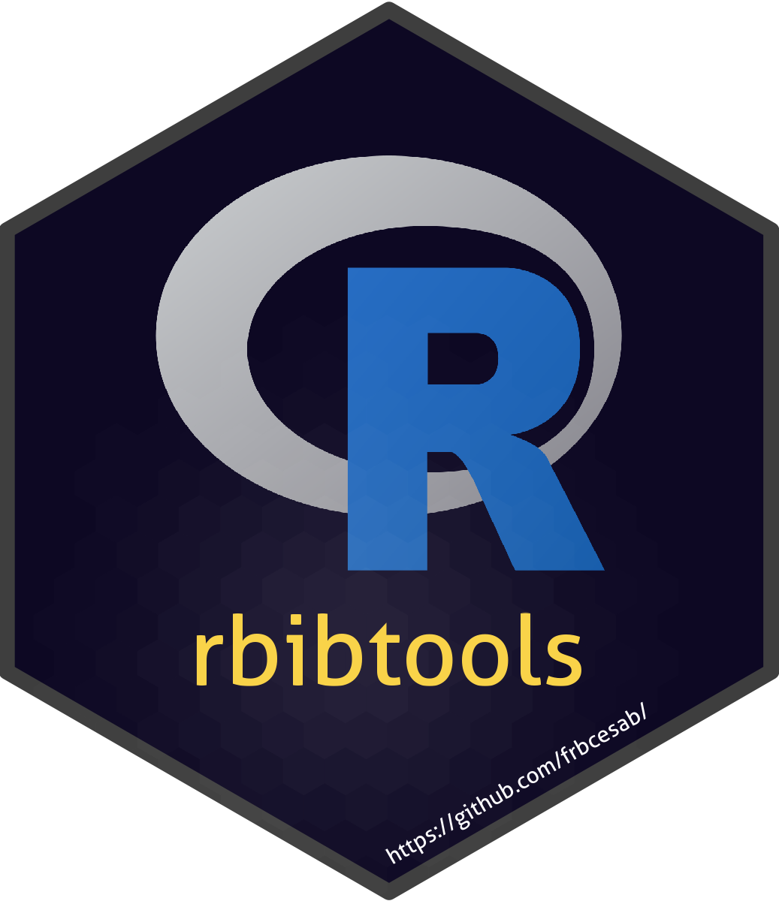

<!-- README.md is generated from README.Rmd. Please edit that file -->

# rbibtools 

<!-- badges: start -->

[](https://github.com/frbcesab/rbibtools/actions/workflows/R-CMD-check.yaml)
[](https://github.com/frbcesab/rbibtools/actions/workflows/pkgdown.yaml)
[](https://choosealicense.com/licenses/gpl-2.0/)
<!-- badges: end -->

## Table of contents

<p align="left">
• <a href="#overview">Overview</a><br> •
<a href="#installation">Installation</a><br> •
<a href="#get-started">Get started</a><br> •
<a href="#citation">Citation</a><br> •
<a href="#contributing">Contributing</a>
</p>

## Overview

The R package `rbibtools` has been developed to import, clean, and
export `.bib` files ([BibTeX](https://www.bibtex.com/) references)
exported by common references management software (e.g. Mendeley,
Zotero).

## Installation

You can install the development version from
[GitHub](https://github.com/) with:

``` r
# install.packages("remotes")
remotes::install_github("FRBCesab/rbibtools")
```

Then you can attach the package `rbibtools`:

``` r
library("rbibtools")
```

## Get started

The main functions of `rbibtools` are `read_bib()` and `write_bib()`.
See the [Get
started](https://frbcesab.github.io/rbibtools/articles/rbibtools.html)
vignette for an overview of the package.

## Citation

Please cite this package as:

> Casajus Nicolas (2024) rbibtools: A toolbox to handle BibTeX files. R
> package version 0.0.1. <https://github.com/FRBCesab/rbibtools>

## Contributing

All types of contributions are encouraged and valued. For more
information, check out our [Contributor
Guidelines](https://github.com/FRBCesab/rbibtools/blob/main/CONTRIBUTING.md).

Please note that the `rbibtools` project is released with a [Contributor
Code of
Conduct](https://contributor-covenant.org/version/2/1/CODE_OF_CONDUCT.html).
By contributing to this project, you agree to abide by its terms.
